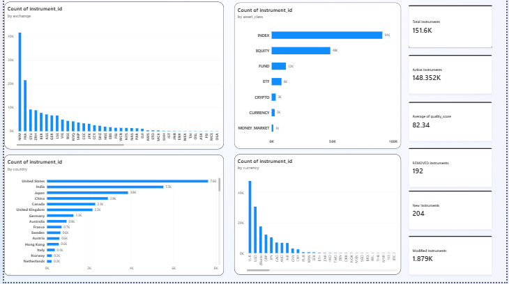
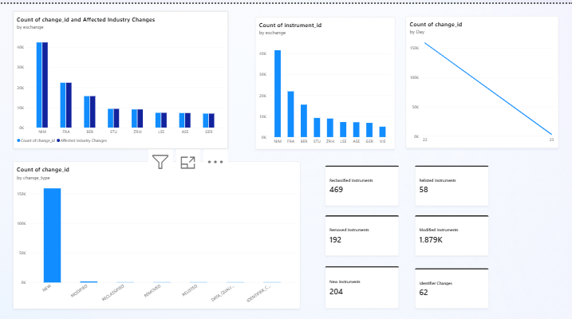
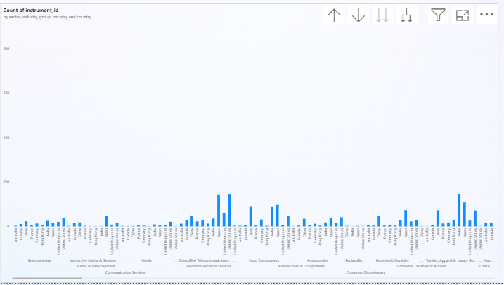
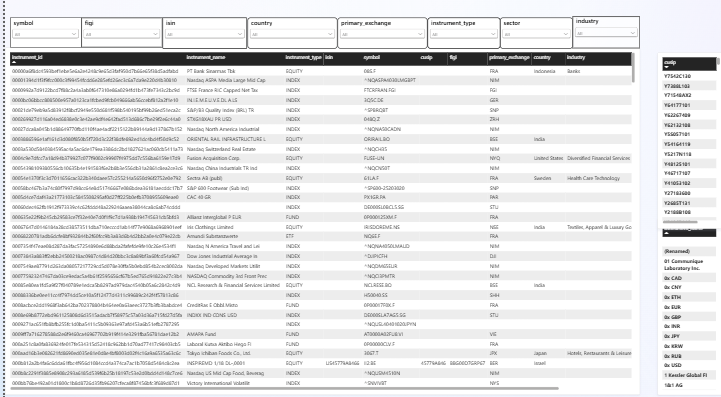

# Financial Universe Control Tower

A lakehouse platform on Azure Databricks that turns the FinanceDatabase instrument
universe into a governed, versioned, quality-scored **Financial Instrument Master**.

The central question this answers is not *"how many instruments are in the file?"*
It is:

> Can we reliably determine what instruments exist, identify their canonical
> entities and listings, validate their data, preserve their history, and explain
> exactly what changed between two source snapshots?

---

## 📸 Pipeline Architecture & Execution
Untitled Diagram.drawio.png

### 1. Azure Data Factory Master Orchestration (`PL_Orchestrate_Control_Tower`)


### 2. Azure Data Factory Metadata-Driven Ingestion (`PL_Metadata_Driven_Ingestion`)


### 3. Databricks Multi-Task Workflow Job (`Financial Universe Control Tower`)


### 4. Databricks Workspace Notebooks (`databricks/notebooks/`)


---

## What the data actually looked like

Profiling came before design, and it changed the design. Three findings mattered:

**1. The folder names did not describe their contents.**

| Folder | Columns actually inside | Real asset class |
|---|---|---|
| `funds/` | `sector, industry, isin, cusip, figi, market_cap` | **EQUITY** |
| `equities/` | `category_group, category, family` | **FUND** |
| `eft/` | `category_group, category, family, isin` | **ETF** |

`funds/` and `equities/` were swapped. The folders were later renamed again in
ADLS (`efts`, `equities_data`, `funds_data`), and at least one file still sits in
a folder whose name implies a different class.

**Consequence:** asset class is derived from each file's **column signature**, never
from its path. Ingestion discovers every CSV, reads its header, and routes it by
what it *is*. A folder holding mixed classes is reported, not silently trusted.

**2. ISIN is what collapses cross-listings.**
4,006 of 7,025 distinct ISINs appear on more than one venue — `IE00B5KQNG97`
trades on BER, GER, FRA and LSE. Keying instruments on symbol would have reported
those as five separate securities.

**3. The reference data is small and knowable.**
The universe spans 73 venue codes, 95 countries and 48 currencies — not the whole
world. Reference dimensions are built from exactly those observed values, so every
reference row exists because a source record referenced it. Two values in the
`currency` column (`MCE`, `KEW`) are not currencies at all and are named as such.

---

## The model: entity ≠ instrument ≠ listing

```
ENTITY        Alcoa Corporation                    the issuer
 └ INSTRUMENT   ordinary shares, US0138721065      the security
    ├ LISTING     NYQ:AA                            where it trades
    ├ LISTING     BER:ALU
    └ LISTING     FRA:ALU
```

Flattening these to one row per ticker would report a company listed on four
venues as four companies and make *"which companies have multiple listings"*
unanswerable. They are also governed differently: a listing can be withdrawn
without the issuer changing.

| Key | Grain | Derivation |
|---|---|---|
| `listing_id` | security on a venue | `sha2(asset_class, symbol, exchange)` |
| `instrument_id` | the security | `sha2('ISIN' + isin)` when the ISIN is well formed, else `listing_id` |
| `entity_id` | the issuer | connected components over an evidence graph |

All keys are **content hashes, not sequences**. Re-running a snapshot reproduces
them byte-for-byte, which is what makes the pipeline idempotent: a re-run MERGEs
rather than duplicating.

### Entity resolution

Connected components over a graph where two rows are linked if they share an
ISIN, a composite FIGI, or a normalised name within one country. Transitive
closure merges chains (NYQ↔BER by ISIN, BER↔FRA by name → one entity).
Implemented as min-label propagation, so there is no GraphFrames dependency.

Two guards keep it honest:
- Blocking keys with implausibly many members are dropped — a key "shared" by
  hundreds of rows is a data defect, not one gigantic company.
- Asset classes with no issuer (indices, FX, crypto) keep a **NULL** entity
  rather than an invented one, and are reported as unmapped.

---

## Data quality

**Severity is separate from score.** A `QUARANTINE` rule blocks a record from the
trusted master (no symbol, no venue, duplicate on the same exchange). A `REVIEW`
rule only lowers the score — a cross-listed German security whose venue country
differs from its domicile is *correct*, and rejecting it would delete real
instruments.

**Weights are per asset class.** Scoring an FX pair with the equity profile would
fail it for lacking an ISIN, a sector and a country — none of which an FX pair can
ever have. Each class is scored only on components that apply to it; every profile
sums to 100.

| Component | EQUITY | ETF | FUND | INDEX | CURRENCY | CRYPTO | MM |
|---|--:|--:|--:|--:|--:|--:|--:|
| identifier completeness | 25 | 20 | 0 | 0 | 0 | 0 | 0 |
| classification completeness | 20 | 20 | 30 | 25 | 0 | 0 | 15 |
| exchange validity | 15 | 15 | 20 | 25 | 10 | 10 | 25 |
| country validity | 15 | 10 | 5 | 5 | 0 | 0 | 0 |
| currency validity | 10 | 15 | 20 | 20 | 45 | 45 | 30 |
| duplicate risk | 15 | 20 | 25 | 25 | 45 | 45 | 30 |

Bands: **≥90 Trusted · 75–89 Review · <75 Quarantine**.

Weights live in `audit.dq_scoring_profile` and are read at run time, so retuning
the model is an `UPDATE`, not a deployment. The pipeline refuses to run if any
profile does not sum to 100.

Rejected records are never deleted — they go to `quarantine.rejected_records`
with their reason, failed column, and the full original record as JSON.

---

## Change detection

The scenario this exists for: yesterday 160,000 instruments, today 160,000
instruments. A row-count check concludes "no change". It is wrong — the same
total hides adds and removes in equal number, reclassifications, and identifier
changes that silently break downstream joins.

A full outer join on `listing_id` classifies every key as NEW / REMOVED / present
in both. For keys in both, tracked columns are unpivoted with `stack()` so one row
is emitted **per changed column**. Comparison is NULL-safe, so "value appeared"
and "value disappeared" both register.

| Columns that moved | Change type |
|---|---|
| `sector`, `industry_group`, `industry`, `category*` | `RECLASSIFIED` |
| `exchange`, `mic`, `market` | `RELISTED` |
| `isin`, `cusip`, `figi`, `composite_figi`, `shareclass_figi` | `IDENTIFIER_CHANGED` |
| `instrument_name`, `currency`, `country`, `status` | `MODIFIED` |
| quality band degraded | `DATA_QUALITY_ISSUE` |

---

## Layout

```
databricks/
  notebooks/           00 setup · 01 profiling · 02 bronze · 03 standardise
                       04 master data · 05 quality · 06 change · 07 gold
  utilities/fuct/      config · reference · schemas · transforms · dq · writer · audit
resources/             bundle job definition
tests/                 local Spark validation harness
bronze/data/           source CSVs (not synced to the workspace)
```

Logic lives in `fuct/`, not in the notebooks, so it is testable and so the quality
rules stay configuration rather than being buried in transformation steps.

---

## Running it

All eight notebooks run as **one job**, in dependency order:

```
setup → source_profiling → bronze_ingestion → schema_standardisation
      → master_data → data_quality → change_detection → gold_processing
```

**From the UI:** Jobs & Pipelines → `[dev] Financial Universe Control Tower` → Run now

**From the CLI:**
```bash
databricks bundle validate -t dev
databricks bundle deploy   -t dev
databricks bundle run financial_universe_pipeline -t dev
```

Reprocess a historical snapshot by overriding one parameter:
```bash
databricks bundle run financial_universe_pipeline -t dev \
  --notebook-params snapshot_date=2026-08-01
```

### Storage

| Layer | Location |
|---|---|
| bronze (raw CSV) | `abfss://destination@learnazure11.dfs.core.windows.net/bronze` |
| silver (Delta) | `abfss://destination@learnazure11.dfs.core.windows.net/silver` |
| gold (Delta) | `abfss://destination@learnazure11.dfs.core.windows.net/gold` |

Silver and gold are registered in Unity Catalog as **external** Delta tables, so
the files sit in the project's own container while remaining queryable as
`catalog.schema.table`.

Access uses the existing UC external location `project` and its managed-identity
credential `financial-databricks`. **No account key, SAS token or password appears
anywhere in this repository.**

### Environment notes

- The workspace accepts **serverless compute only** — the Jobs API rejects
  `new_cluster`. Tasks therefore declare no compute.
- The metastore has no storage root, so a new catalog cannot be created from the
  CLI. Everything lands in the existing `azurelearn` catalog.
- `input_file_name()` is blocked under Unity Catalog; file lineage uses
  `_metadata.file_path`, materialised per file *before* any union (the hidden
  `_metadata` column does not survive one).

---

## Output tables

| Table | Contents |
|---|---|
| `gold.gold_security_master` | current trusted version of every instrument |
| `gold.gold_instrument_changes` | column-level changes between snapshots |
| `gold.gold_data_quality` | scores, bands, failure detail |
| `gold.gold_universe_summary` | counts by class, country, exchange, sector, currency |
| `silver.dim_classification` | SCD2 — classification as at any past date |
| `silver.dim_identifier` | SCD2 — ISIN/CUSIP/FIGI per instrument |
| `silver.fact_listing` | SCD2 — listings, with primary-listing flag |
| `quarantine.rejected_records` | rejects with reason and original record |
| `audit.pipeline_run_log` | per-stage run id, timings, counts, status |

Everything is Delta in Unity Catalog, so it is queryable with plain SQL from a
notebook or SQL warehouse — no separate serving layer is required.

---

## Technical Documentation Index

Detailed architectural and operational documentation is available in the `docs/` directory:

| Document | Description |
|---|---|
| [architecture.md](file:///c:/Users/rushi/OneDrive/Desktop/databrick/docs/architecture.md) | System architecture, Medallion layer design, security model & guarantees |
| [data_model.md](file:///c:/Users/rushi/OneDrive/Desktop/databrick/docs/data_model.md) | Entity vs Instrument vs Listing, ERD, SHA-256 keys, Entity Resolution graph algorithm, SCD2 |
| [data_dictionary.md](file:///c:/Users/rushi/OneDrive/Desktop/databrick/docs/data_dictionary.md) | Complete column-level reference across bronze, silver, gold, quarantine, and audit schemas |
| [pipeline_design.md](file:///c:/Users/rushi/OneDrive/Desktop/databrick/docs/pipeline_design.md) | Ingestion framework, dynamic column-signature routing, lineage, and 8-stage notebook breakdown |
| [data_quality.md](file:///c:/Users/rushi/OneDrive/Desktop/databrick/docs/data_quality.md) | Rule taxonomy, asset-class weighted scoring profiles, quality bands, and quarantine engine |
| [change_detection.md](file:///c:/Users/rushi/OneDrive/Desktop/databrick/docs/change_detection.md) | Full outer join snapshot diffing algorithm, PySpark `stack()` unpivot, and change taxonomy |
| [business_rules.md](file:///c:/Users/rushi/OneDrive/Desktop/databrick/docs/business_rules.md) | Profiling anomalies, folder swap corrections, currency normalization, and graph safety guards |
| [business_questions_answers.md](file:///c:/Users/rushi/OneDrive/Desktop/databrick/docs/business_questions_answers.md) | ANSI SQL reference and answers for all 18 Advanced Business Questions |
| [power_bi_control_tower.md](file:///c:/Users/rushi/OneDrive/Desktop/databrick/docs/power_bi_control_tower.md) | Functional spec for 5-page Power BI dashboard (Overview, Change, Classification, Quality, Explorer) |
| [SETUP.md](file:///c:/Users/rushi/OneDrive/Desktop/databrick/docs/SETUP.md) | Environment setup and pipeline runbook |

