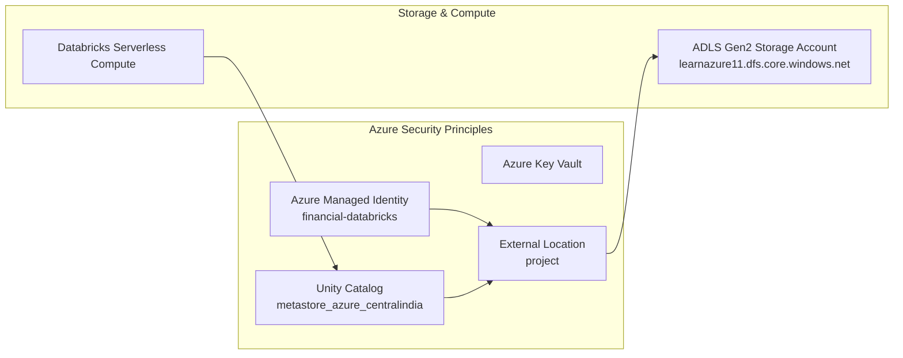

# Technical Architecture - Financial Universe Control Tower

## Executive Summary

The **Financial Universe Control Tower** is an enterprise-grade Financial Master Data Platform built on Microsoft Azure and Azure Databricks using Delta Lake and Unity Catalog. It ingests heterogeneous financial datasets from the `FinanceDatabase` open repository, standardizes diverse asset class schemas into a unified canonical model, resolves company entities and listings, validates data quality using a configurable weighted scoring engine, quaranthines invalid data, preserves historical classifications via SCD Type 2, and detects fine-grained column-level changes across source snapshots.

---

## 1. Overall System Architecture

The solution follows a modern **Medallion Architecture** (Bronze -> Silver -> Master Data -> Gold) orchestrated by Azure Data Factory / Databricks Workflows:

```mermaid
flowchart TD
    subgraph External Source
        FD[FinanceDatabase Repository CSV Snapshots]
    end

    subgraph Azure Data Factory / Databricks Orchestration
        ADF[ADF Ingestion Pipelines / Databricks Workflow Jobs]
    end

    subgraph ADLS Gen2 Data Lake & Unity Catalog (azurelearn)
        B[(Bronze Layer\nRaw CSV Snapshots\nImmutable Dated Partitions)]
        S[(Silver Layer\nStandardized Delta Tables\nCleaned & Typed)]
        MD[(Master Data Engine\nEntity & Listing Resolution\nGraph Min-Label Propagation)]
        G[(Gold Layer\nCurated Delta Tables\nSecurity Master & Changes)]
        Q[(Quarantine Layer\nRejected Records\nFailure Reasons & Audit)]
        A[(Audit Layer\nPipeline Run Logs\nDQ Scoring Profiles)]
    end

    subgraph Serving & Visualization
        SQL[(Azure SQL / Unity Catalog Serving)]
        PBI[Power BI Control Tower\n5 Interactive Dashboards]
    end

    FD --> ADF
    ADF --> B
    B --> S
    S --> MD
    MD --> Q
    MD --> G
    MD --> A
    G --> SQL
    SQL --> PBI
```

---

## 2. Layer-by-Layer Architectural Breakdown

### 2.1 Bronze Layer (Immutable Raw Landing)
- **Purpose**: Preserves raw source CSV snapshots from `FinanceDatabase` without data modification or loss.
- **Storage Pattern**: Partitioned by `snapshot_date=YYYY-MM-DD` under `abfss://destination@learnazure11.dfs.core.windows.net/bronze/`.
- **Lineage Metadata**: Enriched at ingestion with lineage attributes:
  - `source_file`: Original file name
  - `source_url`: Repository URL
  - `source_version`: Git commit or snapshot version
  - `ingestion_timestamp`: UTC timestamp of ingestion
  - `pipeline_run_id`: Execution run UUID
  - `snapshot_date`: Logical date of snapshot

### 2.2 Silver Layer (Standardization & Master Data)
- **Purpose**: Cleans, typed, and standardizes heterogeneous asset class schemas into canonical structures.
- **Components**:
  - `instrument_staging`: Canonical projection of raw CSV fields.
  - `dim_instrument`: Canonical instrument dimensions with content-hashed keys.
  - `dim_entity`: Canonical entity/company dimension resolved via graph connected components.
  - `fact_listing`: Exchange listing facts linked to entities and instruments.
  - `dim_identifier`: Identifier mapping table (ISIN, CUSIP, FIGI, Composite FIGI, Share Class FIGI).
  - `dim_classification`: Historical SCD Type 2 dimension preserving sector/industry changes.
  - `ref_exchange`, `ref_country`, `ref_currency`: Reference lookup dimensions.

### 2.3 Gold Layer (Business-Ready Curated Serving)
- **Purpose**: Delivers trusted, aggregated, and analytics-ready datasets for downstream consumption.
- **Components**:
  - `gold_security_master`: The single source of truth containing current trusted instruments.
  - `gold_instrument_changes`: Fine-grained column-level change log between consecutive snapshots.
  - `gold_data_quality`: Aggregated data quality scores and failure metrics.
  - `gold_universe_summary`: Multi-dimensional summary of universe metrics by asset class, country, exchange, sector, and currency.

### 2.4 Quarantine & Audit Layers
- **Quarantine (`quarantine.rejected_records`)**: Preserves records failing critical validation rules (e.g. missing symbol, missing exchange, duplicate venue listing) with error code, failed column, pipeline run ID, and raw payload serialized as JSON.
- **Audit (`audit.pipeline_run_log`)**: Logs execution metrics for every notebook stage (run ID, start/end time, duration, records read, records written, records rejected, quality score, and status).

---

## 3. Security & Access Control Architecture



1. **Zero-Secret Storage Access**:
   - Access to ADLS Gen2 (`abfss://destination@learnazure11.dfs.core.windows.net`) uses Unity Catalog Managed Identity (`financial-databricks`) and External Location (`project`).
   - No storage account keys, SAS tokens, or passwords are hardcoded anywhere in code or configuration.
2. **Serverless Compute Enforced**:
   - Databricks workspace enforces serverless compute execution.
   - Tasks in Databricks Workflows do not declare cluster configurations (`new_cluster` is rejected by workspace policies).
3. **Role-Based Access Control (RBAC)**:
   - Data access governance enforced at the catalog level in Unity Catalog (`azurelearn`).

---

## 4. Key Architectural Guarantees

- **Idempotency**: All surrogate keys (`listing_id`, `instrument_id`, `entity_id`) are generated using deterministic SHA-256 content hashes. Re-running a snapshot MERGEs clean data without duplicating rows.
- **Reproducibility**: Historical source states are preserved in dated Bronze partitions (`snapshot_date=YYYY-MM-DD`). Time-travel on Silver/Gold Delta tables enables historical point-in-time state reconstruction.
- **Reliability & Auditability**: Every execution logs detailed stage metrics in `audit.pipeline_run_log`. Failures trigger alerts and log structured diagnostics before re-raising exceptions.
