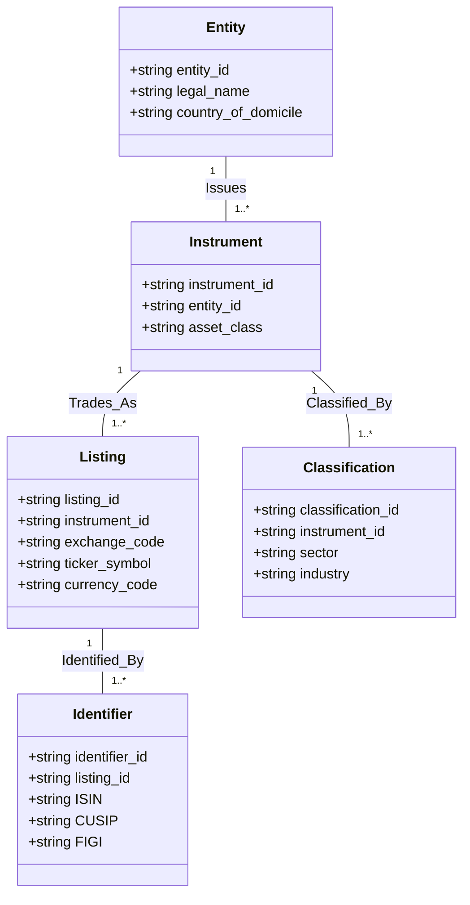

# Technical Design Document: Financial Universe Control Tower

**Document Version:** 1.0  
**Status:** Approved Specification  
**Owner:** Data Engineering & Architecture Team  
**Last Updated:** August 2026  
**Target Audience:** Data Engineers, Solution Architects, Analytics Engineers, Power BI Developers  

---

## 1. Project Overview

The **Financial Universe Control Tower** is a centralized Data Engineering and Financial Master Data Management (MDM) platform built on Microsoft Azure and Databricks. Its primary job is to process financial market data from the `FinanceDatabase` open-source repository and convert unformatted, multi-asset source files into clean, audited, and analytics-ready datasets.

Financial instruments naturally exist in fragmented environments across global exchanges, asset classes, and regional identifiers. This platform establishes a governed pipeline that ingests, cleanses, standardizes, validates, and serves master data across seven main financial asset classes:

- Equities
- ETFs (Exchange Traded Funds)
- Funds / Mutual Funds
- Stock Indices
- Currencies (FX)
- Cryptocurrencies
- Money Market Instruments

```mermaid
flowchart LR
    A[GitHub Source Data<br/>FinanceDatabase CSVs] -->|ADF Metadata Ingestion| B[ADLS Gen2<br/>Bronze Layer]
    B -->|PySpark Processing| C[Databricks Lakehouse<br/>Silver & Quarantine Layers]
    C -->|Master Data & MERGE| D[Delta Lake Storage<br/>Gold Layer]
    D -->|SQL Views| E[Azure SQL / Databricks SQL]
    E -->|Direct Query & Reporting| F[Power BI Control Tower]
```



### Core System Capabilities
1. **Source File Archival:** Preserves raw, point-in-time files in Azure Data Lake Storage Gen2 for auditability and pipeline replay.
2. **Multi-Asset Schema Normalization:** Maps inconsistent source columns across asset types into a unified canonical model.
3. **Entity and Listing Resolution:** Distinguishes between legal corporate issuers and individual exchange listings.
4. **Identifier Mapping:** Links ticker symbols, ISIN, CUSIP, and FIGI identifiers into a single master key.
5. **Data Quality & Quarantine Routing:** Redirects invalid rows to a dedicated Quarantine area instead of silently dropping data.
6. **Attribute-Level Change Detection:** Tracks newly listed, delisted, modified, or reclassified instruments between market updates.
7. **Relational Serving & BI Reporting:** Exposes final datasets via Databricks/Azure SQL views into Power BI dashboards.

---

## 2. Problem Statement & Key Challenges

Flat files downloaded from market providers present several data quality and modeling challenges:

### 2.1 Multi-Exchange Listing Duplication
A single company often lists its shares on multiple global exchanges (for example, trading on NYSE, London Stock Exchange, and XETRA). Flat feeds treat each listing as a completely independent security, making it difficult to analyze total corporate exposure.

### 2.2 Inconsistent Column Schemas
Different asset classes carry fundamentally different attributes:
- **Equities** focus on sector, industry, and market capitalization.
- **ETFs and Funds** focus on fund family, net asset value (NAV), and expense ratios.
- **Money Markets** focus on yields, maturity dates, and credit ratings.

Pipeline code must normalize these differences without losing key asset details.

### 2.3 Identifier Conflicts
Securities are identified using multiple global standards (ISIN, CUSIP, SEDOL, FIGI, Ticker). Identifiers can change due to corporate re-organizations, ticker updates, or regional listing changes.

### 2.4 Silent Data Loss in Ingestion
Traditional pipelines often drop rows with missing values or formatting errors during ETL. This hides source quality issues and leads to incomplete analytics.

### 2.5 Inadequate Volume Checks
Relying solely on row-count totals fails to reveal underlying universe volatility—such as 500 new companies being added while 500 existing companies are delisted.

---

## 3. System Architecture & Tech Stack

The platform is designed around Azure managed services, Databricks Delta Lake, and Power BI.

| Architectural Component | Selected Technology | Technical Purpose & Details |
|---|---|---|
| **Source Repository** | FinanceDatabase (GitHub) | Ingests CSV market data across 7 asset classes via HTTP endpoints. |
| **Orchestration Engine** | Azure Data Factory (ADF) | Drives metadata-based ingestion loops, parameter lookup, and notebook scheduling. |
| **Data Lake Storage** | Azure Data Lake Storage Gen2 | Provides hierarchical object storage for Bronze, Silver, Gold, and Quarantine tiers. |
| **Processing Engine** | Azure Databricks (PySpark) | Runs distributed compute jobs for schema normalization, entity resolution, and change logic. |
| **Storage Format** | Delta Lake | Guarantees ACID transactions, schema enforcement, time-travel history, and MERGE operations. |
| **Governance & Catalog** | Unity Catalog (`azurelearn`) | Enforces central metadata management, access policies, and data lineage across environments. |
| **Relational Serving** | Azure SQL / Databricks SQL | Provides high-performance database views for downstream analytical tools. |
| **Visualization & BI** | Microsoft Power BI | Renders interactive control tower dashboards, coverage reports, and change logs. |
| **Access Control** | Azure Managed Identity / RBAC | Secures credential-less access between ADF, Key Vault, ADLS, and Databricks. |

---

## 4. Medallion Lakehouse Architecture

Data flows through a structured Medallion Architecture to isolate raw landing data from validated master tables:

```mermaid
graph TB
    subgraph Bronze ["1. BRONZE LAYER (Raw Landing)"]
        B1[Immutable Point-in-Time CSV Files]
        B2[Raw Schemas + File Timestamp Metadata]
    end

    subgraph Silver ["2. SILVER LAYER (Standardized & Mastered)"]
        S1[Canonical Data Types & Naming]
        S2[Entity & Listing Resolution]
        S3[Identifier Consolidation]
    end

    subgraph Gate {"DATA QUALITY GATE"}
        DQ{Fails Validation Rules?}
    end

    subgraph Quarantine ["QUARANTINE LAYER"]
        Q1[Isolated Invalid Records]
        Q2[Failure Reasons & Error Codes]
    end

    subgraph Gold ["3. GOLD LAYER (Curated Business Tables)"]
        G1[security_master Table]
        G2[instrument_changes Table]
        G3[data_quality_summary Table]
    end

    Bronze --> Silver
    Silver --> Gate
    Gate -->|No| Gold
    Gate -->|Yes| Quarantine
```

### Layer Details
1. **Bronze Layer:** Stores unmodified raw files partitioned by asset class and snapshot date (`bronze/equities/yyyy=2026/mm=08/dd=25/`).
2. **Silver Layer:** Cleans text fields, standardizes column names, and maps incoming rows to canonical schemas.
3. **Quarantine Layer:** Captures non-compliant rows alongside specific error codes and timestamps for troubleshooting.
4. **Gold Layer:** Hosts production Security Master tables, change detection logs, and aggregated metrics.

---

## 5. Sequential Notebook Pipeline Execution

The Databricks workflow executes nine sequential notebooks in order:

```mermaid
sequenceDiagram
    autonumber
    participant N0 as 00 Setup
    participant N1 as 01 Source Profiling
    participant N2 as 02 Bronze Ingestion
    participant N3 as 03 Schema Standardization
    participant N4 as 04 Master Data Resolution
    participant N5 as 05 Data Quality Validation
    participant N6 as 06 Change Detection
    participant N7 as 07 Gold Processing
    participant N8 as 08 SQL Serving Views

    N0->>N1: Create Unity Catalog schemas and storage paths
    N1->>N2: Analyze incoming file schemas, null counts, and column types
    N2->>N3: Load raw source CSVs into Bronze Delta tables
    N3->>N4: Transform raw columns into unified Silver schema
    N4->>N5: Resolve Entity and Listing keys
    N5->>N6: Evaluate data quality rules; split valid data and Quarantine
    N6->>N7: Compare current snapshot against previous state (SCD Type 2)
    N7->>N8: Populate Gold Security Master and Change tables
    N8-->>Serving: Build SQL views for Power BI reporting
```

---

## 6. Financial Master Data Hierarchy

To resolve duplicate listing issues, the platform separates legal corporate issuers from market listings across five domain levels:

```
Entity (Legal Corporate Issuer, e.g., Apple Inc.)
  └── Instrument (Security Concept, e.g., Common Stock)
        └── Listing (Exchange Trading Venue, e.g., NASDAQ: AAPL)
              ├── Identifier (ISIN: US0378331005, CUSIP: 037833100, FIGI: BBG000B9XRY4)
              └── Classification (Sector: Technology, Industry: Consumer Electronics)
```



---

## 7. Data Quality & Quarantine Engine

### 7.1 Validation Rules Matrix

Data quality checks run immediately after schema standardization in the Silver layer:

| Rule Code | Quality Aspect | Evaluated Attribute | Failure Criteria | System Action |
|---|---|---|---|---|
| `DQ_ERR_001` | Completeness | `ticker_symbol` | Value is `NULL` or empty string `""` | Redirect to Quarantine |
| `DQ_ERR_002` | Completeness | `entity_name` | Value is `NULL` | Redirect to Quarantine |
| `DQ_ERR_003` | Uniqueness | `listing_id` | Duplicate combination of `exchange_code` + `ticker_symbol` | Redirect to Quarantine |
| `DQ_ERR_004` | Validity | `ISIN` | Value does not match standard 12-character alphanumeric format | Flag warning / Quarantine |
| `DQ_ERR_005` | Integrity | `currency_code` | Value is not a valid ISO 4217 code | Redirect to Quarantine |

### 7.2 Quarantine Auditing

When a record fails validation, the system writes the record to `quarantine.invalid_records` with structural error details:

- **`source_dataset`**: Name of the asset class file.
- **`raw_record_data`**: Original JSON payload of the failing row.
- **`failed_rule_code`**: Specific error identifier (e.g., `DQ_ERR_001`).
- **`failure_reason`**: Human-readable error description.
- **`ingestion_timestamp`**: Exact processing datetime.

---

## 8. Change Detection & SCD Type 2 History

### 8.1 Attribute Delta Categories

The change detection module compares the incoming snapshot ($T_0$) against the previous stored state ($T_{-1}$) to isolate specific changes:

- **New Instrument:** Listing exists in $T_0$ but was not present in $T_{-1}$.
- **Removed Instrument:** Listing existed in $T_{-1}$ but is missing from $T_0$.
- **Modified Attribute:** Core details (such as company name or market cap) changed between snapshots.
- **Sector Reclassification:** Sector or industry categorization changed.
- **Relisted Instrument:** Exchange or ticker symbol changed for an existing entity.

### 8.2 SCD Type 2 Implementation Logic

Sector and classification changes are managed using Slowly Changing Dimensions (SCD Type 2) in Delta Lake to maintain full historical tracking:

```sql
-- Delta Lake MERGE Pattern for Historical Change Tracking
MERGE INTO gold.security_master AS target
USING silver_incoming AS source
ON target.listing_id = source.listing_id AND target.is_current = TRUE
WHEN MATCHED AND (
    target.sector <> source.sector OR 
    target.industry <> source.industry
) THEN UPDATE SET 
    target.is_current = FALSE,
    target.effective_end_date = CURRENT_TIMESTAMP()
WHEN NOT MATCHED THEN INSERT (
    listing_id, entity_name, sector, industry, 
    effective_start_date, effective_end_date, is_current
) VALUES (
    source.listing_id, source.entity_name, source.sector, source.industry,
    CURRENT_TIMESTAMP(), NULL, TRUE
);
```

---

## 9. Power BI Control Tower Specifications

The Power BI reporting layer connects directly to SQL views in Azure SQL / Databricks SQL. The dashboard contains four primary pages:

### Page 1: Operational Overview
- **Header KPIs:** Total Instruments, Active Global Listings, Overall Data Quality Pass Rate (%).
- **Visuals:** Asset Class Distribution (Donut Chart), Geographic Market Coverage (Global Map), Daily File Ingestion Status.

### Page 2: Change Intelligence & Universe Volatility
- **Header KPIs:** New Additions, Delistings, Sector Reclassifications, Relisted Securities.
- **Visuals:** Daily Change Trend (Waterfall Chart), Reclassification Audit Table.

### Page 3: Data Quality & Quarantine Investigator
- **Visuals:** Quarantine Volume by Rule Code (Bar Chart), Filterable Failure Log Table displaying raw payloads, source dataset names, and error explanations for data stewards.

### Page 4: Security Master Search & Drill-Through
- **Visuals:** Interactive lookup table allowing analysts to search by Ticker, ISIN, CUSIP, or Company Name to inspect entity hierarchy details.
