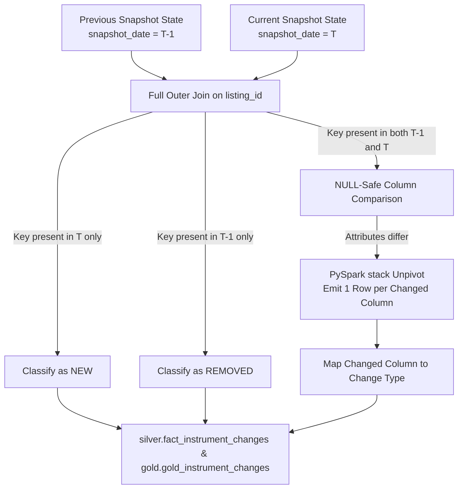

# Financial Universe Change Detection Engine

## Executive Summary

The primary unique requirement of the **Financial Universe Control Tower** is its ability to detect, classify, and audit change across source snapshots. A naive row-count comparison is insufficient: a constant total (e.g., 160,000 instruments yesterday vs. 160,000 instruments today) often masks equal numbers of additions and deletions, reclassifications, and identifier mutations.

This document details the full outer join snapshot diffing algorithm, PySpark unpivot architecture, change taxonomy, and real-world change scenarios.

---

## 1. The Constant-Count Fallacy (Scenario Analysis)

Consider an organization receiving daily snapshots:

```
Yesterday Snapshot:  160,000 instruments
Today Snapshot:      160,000 instruments
Naive Row Count Diff: 0 net change
```

If an ETL system assumes "0 net change means no action required", it fails to detect underlying business mutations:
- **2,143 Modified Instruments**: Corporate name changes, currency updates, or status changes.
- **487 Reclassified Instruments**: Industry sector shifts (e.g., Technology -> Semiconductors).
- **92 Relisted Instruments**: Exchange venue transitions (e.g. listing moved from OTC to NASDAQ).
- **31 Identifier Changes**: ISIN / CUSIP / FIGI updates causing downstream join failures.
- **150 New Listings & 150 Delistings**: Masked completely by equal addition and removal counts.

---

## 2. Snapshot Diffing & PySpark Unpivot Architecture

The change detection engine operates in notebook `06_change_detection.py` and executes a multi-stage differential analysis:



### Unpivot Implementation using PySpark `stack()`:
When a record exists in both snapshots, tracked columns are unpivoted dynamically so that **exactly one audit record is emitted per modified attribute**:

```python
# Conceptual PySpark unpivot stack transformation
change_df = matched_df.select(
    col("listing_id"),
    col("instrument_id"),
    expr("""
        stack(7,
            'instrument_name', prev_name, curr_name,
            'sector', prev_sector, curr_sector,
            'industry', prev_industry, curr_industry,
            'exchange', prev_exchange, curr_exchange,
            'isin', prev_isin, curr_isin,
            'figi', prev_figi, curr_figi,
            'quality_band', prev_band, curr_band
        ) as (column_changed, old_value, new_value)
    """)
).filter("old_value <=> new_value IS FALSE") # NULL-safe inequality comparison
```

---

## 3. Standardized Change Taxonomy

Every detected change is mapped to a standardized business change type:

| Change Type | Triggering Attribute Columns | Description |
|---|---|---|
| `NEW` | `listing_id` (present in T only) | A new financial instrument listing appeared in the universe |
| `REMOVED` | `listing_id` (present in T-1 only) | An existing instrument listing disappeared or was delisted |
| `RECLASSIFIED` | `sector`, `industry_group`, `industry`, `category` | Taxonomy / classification shift |
| `RELISTED` | `exchange`, `market`, `mic` | Venue transition or listing venue migration |
| `IDENTIFIER_CHANGED` | `isin`, `cusip`, `figi`, `composite_figi`, `shareclass_figi` | External security identifier update |
| `MODIFIED` | `instrument_name`, `currency`, `country`, `status` | General instrument metadata update |
| `DATA_QUALITY_ISSUE` | `quality_band`, `quality_score` | Instrument degraded from `TRUSTED` to `REVIEW` or `QUARANTINE` |

---

## 4. Change Record Output Schema

All detected changes land in `gold.gold_instrument_changes` and `silver.fact_instrument_changes`:

| Column Name | Sample Value | Description |
|---|---|---|
| `change_id` | `chg_891f24a09c` | Unique change event surrogate key |
| `instrument_id` | `inst_037833100` | Target canonical instrument ID |
| `listing_id` | `list_nasdaq_aapl` | Target listing ID |
| `symbol` | `AAPL` | Ticker symbol |
| `change_date` | `2026-08-24` | Snapshot execution date |
| `change_type` | `RECLASSIFIED` | Standardized change category |
| `column_changed` | `industry` | Name of modified attribute |
| `old_value` | `Semiconductors` | Attribute value in previous snapshot |
| `new_value` | `Semiconductor Equipment` | Attribute value in current snapshot |
| `source_snapshot` | `2026-08-24` | Source snapshot date |
| `pipeline_run_id` | `c8a2b341-91ef...` | Pipeline execution run UUID |

---

## 5. Audit & Downstream Integration

- **Power BI Instrument Change Monitor**: Page 2 of the Power BI dashboard connects directly to `gold.gold_instrument_changes` to visualize daily change trends, top affected exchanges, and reclassification heatmaps.
- **Automated Alerts**: Downstream analytics systems query `gold.gold_instrument_changes` where `change_type = 'IDENTIFIER_CHANGED'` to update mapping tables without failing join pipelines.
