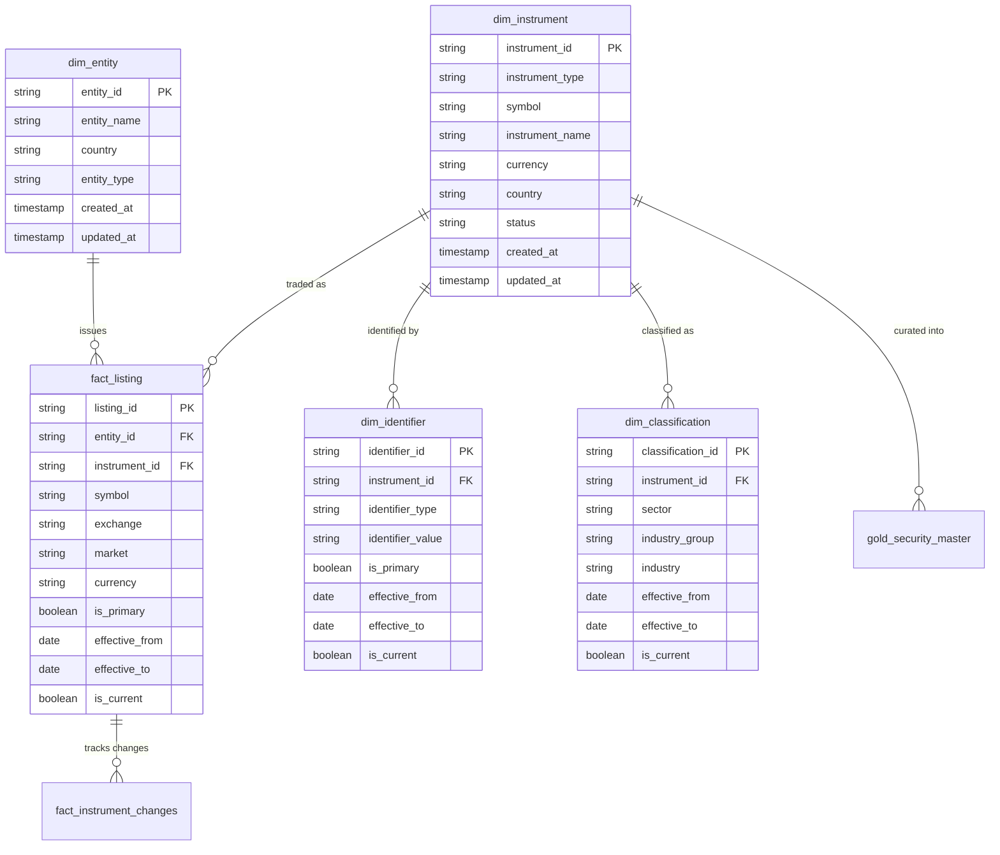
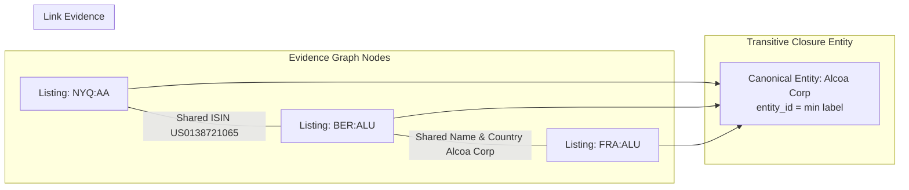

# Data Model & Entity Resolution Design

## Executive Summary

The **Financial Universe Control Tower** separates financial data into distinct concepts rather than treating every ticker symbol as an independent company. This document defines the canonical master model, key derivation formulas, entity resolution graph algorithm, and historical tracking mechanisms (SCD Type 2).

---

## 1. Conceptual Breakdown: Entity vs Instrument vs Listing vs Identifier vs Classification

Traditional ETL processes often flatten ticker data into a single table. This causes severe data corruption when companies list on multiple exchanges or change names.

```
ENTITY (The Issuer)
 └── Apple Inc. (entity_id = hash)
      └── INSTRUMENT (The Security)
           └── Ordinary Shares (instrument_id = hash)
                ├── LISTING (Where it trades)
                │    ├── NASDAQ: AAPL (listing_id = hash_1)
                │    ├── ETR: APC (listing_id = hash_2)
                │    └── LSE: 0R2V (listing_id = hash_3)
                ├── IDENTIFIER (External Keys)
                │    ├── ISIN: US0378331005
                │    ├── CUSIP: 037833100
                │    └── FIGI: BBG000B9XRY4
                └── CLASSIFICATION (SCD Type 2 Taxonomy)
                     └── Sector: Technology | Industry: Consumer Electronics
```

### Why Flattening Fails:
1. **Multiple Listings**: Apple Inc. trades on NASDAQ (`AAPL`), Frankfurt (`APC`), and London (`0R2V`). Flattening treats them as three distinct companies, inflating company counts by 300%.
2. **Identifier Aliasing**: An ISIN identifies a security globally, whereas a symbol identifies a specific exchange listing.
3. **Governance Separation**: An exchange listing can be suspended or relisted without altering the underlying company structure.

---

## 2. Entity Relationship Diagram (ERD)



---

## 3. Key Derivation & SHA-256 Content Hashing

All surrogate keys in the platform are generated deterministically using SHA-256 content hashing. This guarantees **idempotency** across pipeline runs.

| Key Name | Granularity | Derivation Formula |
|---|---|---|
| `listing_id` | Venue Listing | `sha2(concat_ws('||', upper(trim(asset_class)), upper(trim(symbol)), upper(trim(exchange))), 256)` |
| `instrument_id` | Security | If valid ISIN: `sha2(concat_ws('||', 'ISIN', upper(trim(isin))), 256)`<br>Else: fallback to `listing_id` |
| `entity_id` | Canonical Issuer | Derived from graph connected components algorithm (`min(member_listing_ids)`) |
| `identifier_id` | Identifier Link | `sha2(concat_ws('||', instrument_id, identifier_type, identifier_value), 256)` |
| `classification_id` | Classification Version | `sha2(concat_ws('||', instrument_id, sector, industry_group, industry, effective_from), 256)` |

---

## 4. Entity Resolution Graph Algorithm

To resolve canonical entities across fragmented exchanges, the system executes a **Connected Components Algorithm using Min-Label Propagation** (pure PySpark without external GraphFrames dependencies).



### Resolution Workflow:
1. **Edge Extraction**: Generates candidate linkage pairs based on shared strong identifiers:
   - Shared ISIN
   - Shared Composite FIGI
   - Shared Normalized Company Name + Country
2. **Blocking Key Guard**: Pairs matching overly generic names (e.g. `Inc`, `Corp`, `Limited`) or keys linked to >50 instruments are dropped to prevent graph explosion.
3. **Iterative Label Propagation**:
   - Assigns initial node label = `listing_id`.
   - Iteratively updates each node's label to the `min(neighbor_labels)` across connected edges.
   - Converges when zero label mutations occur between iterations.
4. **NULL Entity Assignment**: Asset classes lacking an issuer (e.g. Indices, FX, Crypto) are assigned `entity_id = NULL` rather than an invented entity.

---

## 5. Historical Data & SCD Type 2 Implementation

Classifications and venue listings change over time (e.g. an instrument reclassified from *Software* to *IT Services*). The Silver layer tracks history using **Slowly Changing Dimension (SCD) Type 2**.

### SCD Type 2 Columns:
- `effective_from`: Snapshot date when the attribute state became active.
- `effective_to`: Date when the state was superseded (`9999-12-31` for current record).
- `is_current`: Boolean flag (`true` for current record, `false` for historical).

### Upsert / Merge Logic:
When a changed record arrives in a new snapshot:
1. The existing record with `is_current = true` is updated: `effective_to = snapshot_date - 1 day` and `is_current = false`.
2. A new record is inserted: `effective_from = snapshot_date`, `effective_to = 9999-12-31`, and `is_current = true`.

This enables point-in-time time-travel queries: *"What was the classification of Instrument X on 2025-06-15?"*
