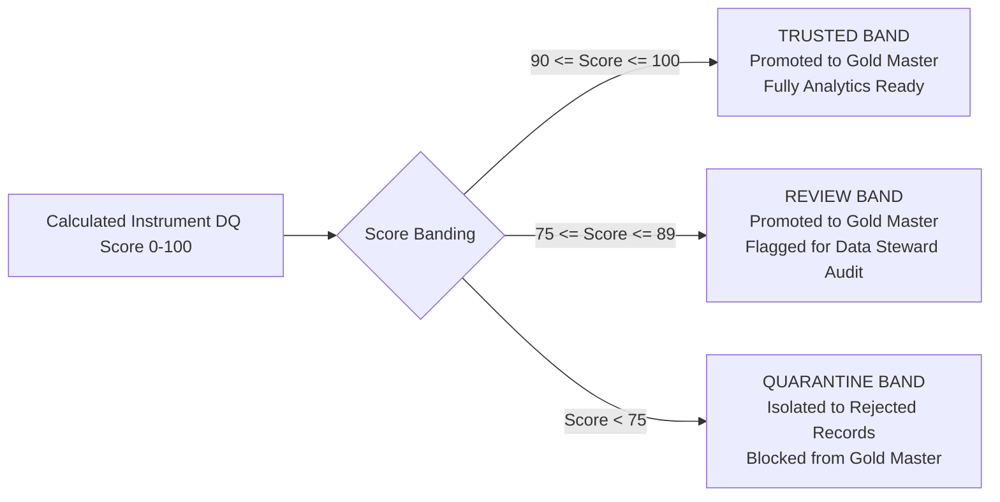
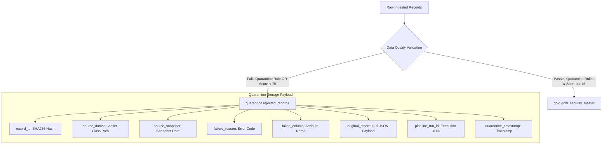

# Data Quality Framework & Quarantine Engine

## Executive Summary

The **Financial Universe Control Tower** features a production-grade, configurable Data Quality Framework. It enforces data validation across four dimensions (Completeness, Uniqueness, Consistency, Referential Integrity), scores instruments dynamically using asset-class specific weighted profiles, and isolates invalid or conflicting records into a Quarantine layer without silent data loss.

---

## 1. Rule Classification & Severity Taxonomy

Data quality checks are divided into two distinct severity categories:

### 1.1 Hard Quarantine Rules (`SEVERITY_QUARANTINE`)
Records violating critical structural invariants are immediately isolated into `quarantine.rejected_records` and blocked from the Gold Security Master.
- `MISSING_SYMBOL`: Ticker symbol is NULL or empty string.
- `MISSING_EXCHANGE`: Exchange venue is missing for listed asset classes (Equities, ETFs).
- `DUPLICATE_VENUE_LISTING`: Multiple active records share the exact same symbol on the same exchange venue in the same snapshot.
- `INVALID_IDENTIFIER`: ISIN fails checksum validation (ISO 6166 checksum failure).

### 1.2 Soft Scoring Rules (`SEVERITY_REVIEW`)
Records violating non-critical business rules are retained in the master data but receive lower quality scores.
- `COUNTRY_MISMATCH`: Security domicile country differs from primary listing venue exchange country.
- `MISSING_CLASSIFICATION`: Sector or industry classification is missing for Equities or Funds.
- `MISSING_SECONDARY_IDENTIFIER`: ISIN is present but CUSIP or FIGI is missing.

---

## 2. Dynamic Asset-Class Weighted Scoring Matrix

Scoring an FX currency pair using Equity rules would incorrectly penalize the FX pair for lacking an ISIN, sector, or country. Therefore, quality scores are computed using **per-asset-class weighted profiles**.

Every asset class profile is stored dynamically in `audit.dq_scoring_profile` and **must sum to exactly 100%**.

| Quality Component | EQUITY | ETF | FUND | INDEX | CURRENCY | CRYPTO | MONEY_MARKET |
|---|--:|--:|--:|--:|--:|--:|--:|
| **Identifier Completeness** | 25% | 20% | 0% | 0% | 0% | 0% | 0% |
| **Classification Completeness** | 20% | 20% | 30% | 25% | 0% | 0% | 15% |
| **Exchange Validity** | 15% | 15% | 20% | 25% | 10% | 10% | 25% |
| **Country Validity** | 15% | 10% | 5% | 5% | 0% | 0% | 0% |
| **Currency Validity** | 10% | 15% | 20% | 20% | 45% | 45% | 30% |
| **Duplicate Risk** | 15% | 20% | 25% | 25% | 45% | 45% | 30% |
| **TOTAL SCORE** | **100%** | **100%** | **100%** | **100%** | **100%** | **100%** | **100%** |

### Mathematical Formula:
$$\text{Score}(i) = \sum_{c \in \text{Components}} \text{Weight}(c, \text{AssetClass}(i)) \times \text{Pass}(c, i)$$

Where $\text{Pass}(c, i) = 1.0$ if component check passes, and $0.0$ if it fails.

---

## 3. Quality Band Categorization

Each processed instrument is assigned to a data quality band based on its calculated score:

---

## 4. Quarantine Framework Architecture

Invalid records are never silently deleted. They are preserved in `quarantine.rejected_records` to ensure 100% data auditability and traceability.

---

## 5. Runtime Tuning & Governance

- **No Code Re-deployments**: Quality rule weights live as reference data in `audit.dq_scoring_profile`. Adjusting weights is done via an SQL `UPDATE` statement without modifying Python code.
- **Invariant Validation Guard**: At pipeline initialization (`05_data_quality.py`), the engine executes a pre-run validation query ensuring `SUM(weight) = 100` for every active asset class. If any profile totals $\neq 100$, the pipeline aborts immediately with an audit exception.
