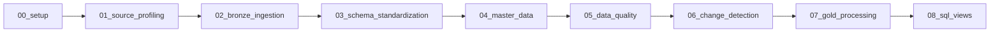
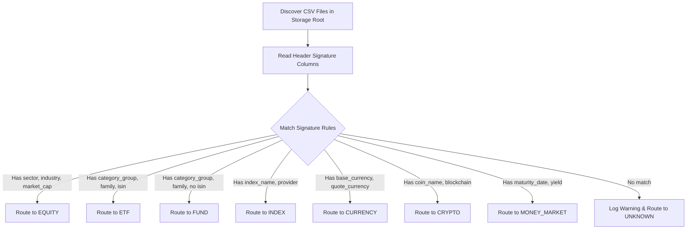

# Pipeline Design & Ingestion Framework

## Executive Summary

The **Financial Universe Control Tower** uses a metadata-driven ingestion framework orchestrated via Azure Data Factory (ADF) and Azure Databricks Workflows (configured via Databricks Asset Bundles - DABs). This document details the orchestration flow, column signature routing engine, Unity Catalog lineage tracking, and the 8-stage Databricks notebook execution pipeline.

---

## 1. Orchestration Architecture & Workflow Dependency Graph

All pipeline stages are executed sequentially in dependency order to maintain data consistency and referential integrity across Medallion layers:



### Databricks Asset Bundle (DAB) Configuration
The workflow pipeline is defined declaratively in `resources/financial_universe_pipeline_job.yml` using Databricks Asset Bundles:
- **Target Environments**: `dev`, `prod`
- **Compute Policy**: Serverless execution (no cluster management overhead)
- **Parameters**: `catalog`, `snapshot_date`, `source_root`, `silver_root`, `gold_root`, `reprocess`

---

## Pipeline Execution Screenshots

### 1. Azure Data Factory Master Orchestration Pipeline (`PL_Orchestrate_Control_Tower`)


### 2. Azure Data Factory Metadata-Driven Ingestion Pipeline (`PL_Metadata_Driven_Ingestion`)


### 3. Databricks Multi-Task Workflow Job Pipeline (`Financial Universe Control Tower`)


### 4. Databricks Workspace Notebooks (`notebooks/`)


---

## 2. Dynamic Asset Class Routing (Column Signature Analysis)

### The Profiling Problem:
Data profiling revealed that folder names in the source repository do **not** reliably indicate asset class contents.
- CSVs in `funds/` contain `sector`, `industry`, `isin`, `cusip`, `figi`, `market_cap` (which are **Equity** attributes).
- CSVs in `equities/` contain `category_group`, `category`, `family` (which are **Fund** attributes).
- CSVs in `eft/` contain `category_group`, `category`, `family`, `isin` (which are **ETF** attributes).

### Signature-Based Discovery Engine:
To prevent silent data corruption, the ingestion engine inspects the CSV header signature of every discovered file rather than relying on folder directory paths:



---

## 3. Unity Catalog File Lineage Tracking

In legacy Spark, `input_file_name()` is used to track source file lineage. However, under **Unity Catalog**, `input_file_name()` is restricted.

### Unity Catalog Solution:
Lineage tracking uses the file metadata column `_metadata.file_path`.
- **Critical Requirement**: Because `_metadata` is a hidden, file-backed column, it **does not survive a `union()` operation**.
- **Implementation Pattern**:
  ```python
  # Materialize file_path PER FILE BEFORE performing any union
  df_single_file = spark.read.option("header", "true").csv(file_path) \
      .withColumn("source_file", col("_metadata.file_path")) \
      .withColumn("ingestion_timestamp", current_timestamp()) \
      .withColumn("pipeline_run_id", lit(pipeline_run_id))
  ```

---

## 4. Detailed 8-Stage Databricks Notebook Pipeline

### Stage 00: Setup (`00_setup.py`)
- Initializes catalog (`azurelearn`), schemas (`bronze`, `silver`, `gold`, `quarantine`, `audit`), external locations, and lookup tables (`audit.dq_scoring_profile`, `audit.dq_rule_catalogue`).

### Stage 01: Source Profiling (`01_source_profiling.py`)
- Scans `bronze/data` landing directory.
- Evaluates file headers against asset class column signatures.
- Detects schema drift and populates `audit.source_profile`.

### Stage 02: Bronze Ingestion (`02_bronze_ingestion.py`)
- Reads raw CSV files for active datasets.
- Materializes file lineage metadata (`source_file`, `snapshot_date`, `pipeline_run_id`).
- Writes immutable dated snapshot partitions to `bronze.<asset_class>` using `replaceWhere`.

### Stage 03: Schema Standardization (`03_schema_standardization.py`)
- Reads raw Bronze snapshot partitions.
- Casts strings to canonical data types, trims whitespace, converts empty strings to `NULL`.
- Maps heterogeneous asset class columns into `silver.instrument_staging`.

### Stage 04: Master Data Engine (`04_master_data.py`)
- Derives SHA-256 surrogate keys (`listing_id`, `instrument_id`).
- Executes Min-Label Propagation graph entity resolution to populate `silver.dim_entity`.
- Populates `silver.dim_instrument`, `silver.fact_listing`, `silver.dim_identifier`, and `silver.dim_classification`.

### Stage 05: Data Quality Engine (`05_data_quality.py`)
- Runs automated data quality rules (Completeness, Uniqueness, Consistency, Referential Integrity).
- Computes weighted quality scores per asset class against `audit.dq_scoring_profile`.
- Routes records to `gold.gold_security_master` (≥75 score) or `quarantine.rejected_records` (<75 or critical quarantine failure).

### Stage 06: Change Detection Engine (`06_change_detection.py`)
- Compares current snapshot Silver state against previous snapshot Silver state using full outer join on `listing_id`.
- Unpivots changed attributes using `stack()`.
- Classifies change events (`NEW`, `REMOVED`, `MODIFIED`, `RECLASSIFIED`, `RELISTED`, `IDENTIFIER_CHANGED`, `DATA_QUALITY_ISSUE`) into `silver.fact_instrument_changes`.

### Stage 07: Gold Processing (`07_gold_processing.py`)
- Builds business-ready curated tables (`gold.gold_security_master`, `gold.gold_instrument_changes`, `gold.gold_data_quality`, `gold.gold_universe_summary`).

### Stage 08: Serving Views (`08_sql_views.py`)
- Creates SQL serving layer views and analytical models in Unity Catalog for Azure SQL / Power BI integration.

---

## 5. Audit Logging & Fault Tolerance

Every stage wraps its logic in a structured try-except block logging execution metrics to `audit.pipeline_run_log`:

```sql
SELECT 
    stage,
    status,
    duration_seconds,
    records_read,
    records_written,
    records_rejected,
    quality_score
FROM azurelearn.audit.pipeline_run_log
WHERE pipeline_run_id = 'c8a2b341-91ef-4e2a-84bf-31294ef19230'
ORDER BY start_time ASC;
```

If a stage fails:
1. The error message and full stack trace are written to `audit.pipeline_run_log` with status `FAILED`.
2. The exception is re-raised to cause the Databricks Workflow job task to fail visibly and trigger ADF retry rules.
